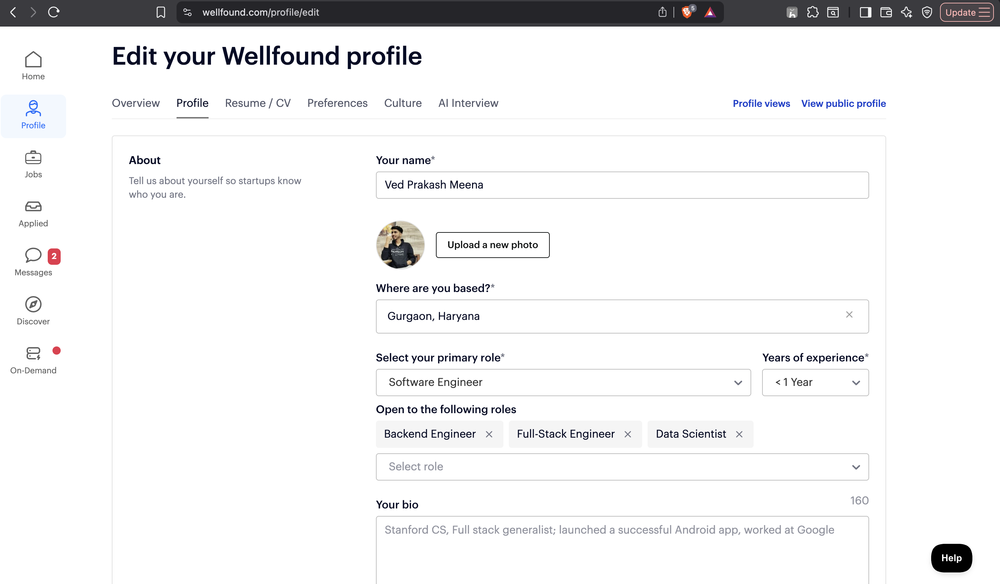
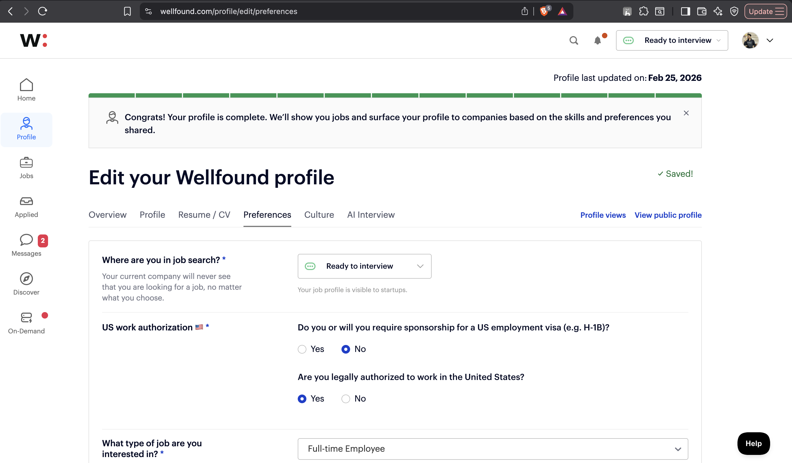
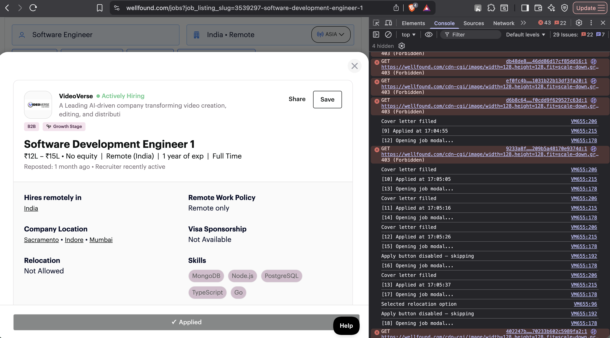
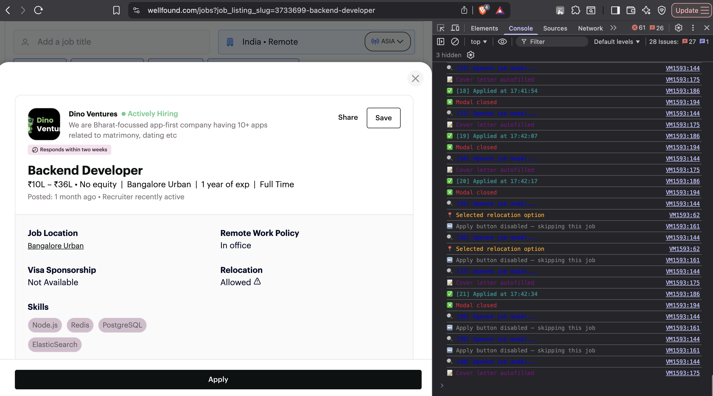

# Wellfound Auto-Apply Script

A browser console script that automates job applications on [Wellfound (AngelList)](https://wellfound.com/jobs).

Designed for **freshers and early-career engineers** targeting SDE-1, Junior, and Associate Engineer roles with 0-2 years of experience. The script filters out senior/irrelevant roles automatically and submits a customized cover letter for every eligible application.

---

## Disclaimer

- This script is for personal use only.
- You must update the `CONFIG` block and cover letter with **your own details** before running.
- Do not use someone else's profile information.
- Use responsibly. Wellfound may rate-limit or flag accounts that apply in high volumes very quickly — the script includes built-in delays to reduce this risk.

---

## Table of Contents

1. [What the Script Does](#what-the-script-does)
2. [Step 1 — Create a Wellfound Account](#step-1--create-a-wellfound-account)
3. [Step 2 — Complete Your Profile](#step-2--complete-your-profile)
4. [Step 3 — Customize the Script](#step-3--customize-the-script)
5. [Step 4 — Open the Jobs Page](#step-4--open-the-jobs-page)
6. [Step 5 — Open the Browser Console](#step-5--open-the-browser-console)
7. [Step 6 — Run the Script](#step-6--run-the-script)
8. [Console Output Reference](#console-output-reference)
9. [How Role and YOE Filtering Works](#how-role-and-yoe-filtering-works)
10. [Troubleshooting](#troubleshooting)
11. [FAQ](#faq)
12. [Repository Structure](#repository-structure)

---

## What the Script Does

| Feature | Details |
|---------|---------|
| Role filtering | Only applies to SDE-1, Junior, Associate, and Software Engineer roles |
| Senior role exclusion | Automatically skips Senior, Staff, Principal, Lead, Manager, Director titles |
| YOE filter | Skips jobs that require more than 2 years of experience (configurable) |
| Cover letter | Fills your customized cover letter in every application automatically |
| Skill questions | Answers skill-level radio questions (Intermediate for 3-option, Beginner for 2-option) |
| Relocation questions | Handles location preference dropdowns if they appear |
| Auto scroll | Scrolls the page to load all lazy-loaded job listings |
| Summary report | Logs Applied / Skipped / Filtered counts at the end of each run |

---

## Step 1 — Create a Wellfound Account

1. Open [wellfound.com](https://wellfound.com) in Google Chrome.


2. Click **Sign Up** in the top-right corner.

> Tip: Using "Continue with LinkedIn" auto-fills your profile from LinkedIn and saves significant time.

3. Select **"I am a candidate looking for a job"** when prompted.
4. Verify your email address if required.


---

## Step 2 — Complete Your Profile

A complete profile increases your visibility to recruiters. Fill every section before running the script.

### 2.1 Basic Information

Go to [wellfound.com/u/edit](https://wellfound.com/u/edit) and fill in:

- Full name
- Profile photo
- One-line headline (example: `Final Year CS Student | Java · Spring Boot · React`)
- City/location
- LinkedIn URL
- GitHub URL
- Portfolio URL (if available)



### 2.2 Work Experience

Click **Add Position** and add your internships with:
- Job title, company name, and date range
- 2-3 bullet points describing what you built or contributed

### 2.3 Education

Add your college, degree, branch, and expected graduation year.

### 2.4 Skills

Add all skills relevant to your stack. These are used by Wellfound for matching. Example:

```
Java, Spring Boot, Spring Security, Python, FastAPI, React.js,
PostgreSQL, MySQL, AWS, Docker, Git, LangChain, REST API, Node.js
```


### 2.5 Upload Resume

Navigate to the Resume section in your profile and upload your latest PDF resume.

> Do not commit your resume to this repository or any public repository.

### 2.6 Job Preferences

| Field | Recommended Value |
|-------|------------------|
| Job Type | Full-time |
| Role | Software Engineer |
| Experience Level | Entry Level / Junior |
| Location | Your preferred cities + Remote |
| Expected Salary | Your target range |
| Availability | Immediate or your expected joining date |



### 2.7 Check Profile Completeness

Your profile progress should be at 100% before running the script.
Visit `wellfound.com/u/YOUR_USERNAME` to preview how recruiters see your profile.


---

## Step 3 — Customize the Script

> This is the most important step. Do not skip it.

Open `wellfound_autoapply.js` in any text editor and update the `CONFIG` block at the top of the file:

```javascript
const CONFIG = {
  name: "Your Full Name",                            // replace
  college: "Your College (Graduating Month Year)",   // replace
  currentRole: "Your Current Role at Company",       // replace

  targetRoleTitles: [                                // add/remove as needed
    "software engineer", "sde", "backend engineer", ...
  ],

  excludedTitles: [                                  // roles to always skip
    "senior", "staff", "principal", ...
  ],

  maxYOE: 2,                                         // max experience required

  github: "https://github.com/YOUR_USERNAME",        // replace
  linkedin: "https://www.linkedin.com/in/YOUR_USERNAME", // replace
  portfolio: "https://your-portfolio.vercel.app",    // replace
};
```

Then scroll down and replace the cover letter placeholders in `applicationText`:

```javascript
[POINT 1 -- Describe your strongest experience]
[POINT 2 -- Second strongest point]
[POINT 3 -- Notable project]
[POINT 4 -- Any other relevant experience]
```

Replace each `[POINT X -- ...]` line with a real sentence from your own background.

---

## Step 4 — Open the Jobs Page

Open this URL in Google Chrome after logging in:

```
https://wellfound.com/jobs?role=software-engineer&jobType=full-time
```

Or filter manually on [wellfound.com/jobs](https://wellfound.com/jobs):

| Filter | Value |
|--------|-------|
| Role | Software Engineer / Backend Engineer |
| Job Type | Full-time |
| Experience | 0-2 years |
| Location | Your preferred cities or Remote |

Make sure job cards are visible on the page before proceeding.


---

## Step 5 — Open the Browser Console

**macOS (Chrome):** `Cmd + Option + J`

**Windows (Chrome):** `Ctrl + Shift + J`

The DevTools panel opens at the bottom of the browser. Click the **Console** tab.


### Allow Pasting (First Time Only)

Chrome blocks paste by default. If you see a paste warning, type exactly the following into the console and press Enter:

```
allow pasting
```

You will see a confirmation message. After that, paste the script normally.


---

## Step 6 — Run the Script

1. Open `wellfound_autoapply.js` in a text editor.
2. Select all (`Cmd + A` on macOS / `Ctrl + A` on Windows).
3. Copy (`Cmd + C` / `Ctrl + C`).
4. Click inside the browser console next to the `>` prompt.
5. Paste (`Cmd + V` / `Ctrl + V`).
6. Press `Enter`.

Do not switch tabs, scroll manually, or click elsewhere while the script is running.


---

## Console Output Reference

Once the script is running, you will see output like this:

```
Wellfound Auto-Apply started
Targeting SDE-1 / Junior / Associate roles -- max 2 YOE

Skipping excluded role: "Senior Backend Engineer"
Skipping 5+ YOE role: "Staff Software Engineer"
[1] Opening job modal...
Cover letter filled
Selected Intermediate for skill question
[1] Applied at 10:23:04
Modal closed

[2] Opening job modal...
Cover letter filled
[2] Applied at 10:23:11
Modal closed

Scrolling to load more jobs (1/15)...

--- Run complete ---
Applied  : 18
Skipped  : 3
Filtered : 11  (senior / irrelevant roles excluded)
Total    : 32
```





---

## How Role and YOE Filtering Works

The script reads each job card's title and text **before opening the modal**, so it never wastes time on irrelevant roles.

### Roles the script will apply to (default):
- Software Engineer, SDE, SDE-1, Software Developer
- Backend Engineer, Full Stack Engineer
- Associate Engineer, Junior Engineer, Junior Developer
- Engineer I

### Roles the script will skip automatically:
- Senior / Staff / Principal / Lead / Architect
- Engineering Manager, Director, VP, Head of Engineering
- Any role whose card text mentions 5+, 7+, 8+, or 10+ years

### YOE check:
If a job card contains text like `"3+ years required"`, and that number exceeds `maxYOE` (default: 2), the job is skipped without opening the modal.

You can adjust `targetRoleTitles`, `excludedTitles`, and `maxYOE` in the `CONFIG` block to match your own preferences.

---

## Troubleshooting

| Problem | Fix |
|---------|-----|
| Chrome shows paste warning | Type `allow pasting` in the console first, then paste the script |
| Cover letter is not filling | The React-compatible native setter is already used in the script — confirm your edits were saved |
| "Access denied" after a few jobs | Wellfound is rate-limiting. Wait 5-10 minutes then run the script again |
| Modal not loading | Slow network. Increase the `waitForElement` timeout from `5000` to `8000` in the script |
| Script finishes before all jobs are processed | Increase `maxScrolls` from `15` to `25` at the bottom of the script |
| All jobs being filtered | Check your `targetRoleTitles` — add more keywords that match the titles visible on your search results page |
| Apply button always disabled | Your Wellfound profile is likely incomplete — go back to Step 2 |

---

## FAQ

**Will this get my account banned?**
Wellfound does not explicitly ban for console-based automation. The built-in 4-second delay between applications reduces the risk significantly. Avoid running it for more than 50-60 jobs in a single session.

**What happens if a job has custom text questions (not radio buttons)?**
The script will skip jobs where the Apply button remains disabled after attempting to handle the questionnaire. Text-input questions are not currently handled.

**Can I run this on multiple pages?**
Yes. Navigate to the next page or change your filters and run the script again. The `processedButtons` set resets with each new run.

**Should I change `maxYOE`?**
2 is a reasonable ceiling for freshers and early-career candidates. Setting it higher risks matching roles that expect more experience than you have.

**A senior role slipped through — why?**
The job card may not have used a keyword that is in `excludedTitles`. Add the specific keyword you saw to the `excludedTitles` array in `CONFIG`.

---

## Repository Structure

```
Wellfound_AutoApply/
├── wellfound_autoapply.js    Main script — customize CONFIG and cover letter before use
├── screenshots/              Screenshots used in this README
└── README.md                 This file
```

> The resume file is intentionally excluded from this repository via .gitignore.
> Never commit a personal resume to a public repository.

---

## Contributing

If you find a bug or a selector has changed on Wellfound, open an issue or submit a pull request. Include the console output and a description of what you expected to happen.

---

*Built for early-career engineers navigating the job hunt.*
