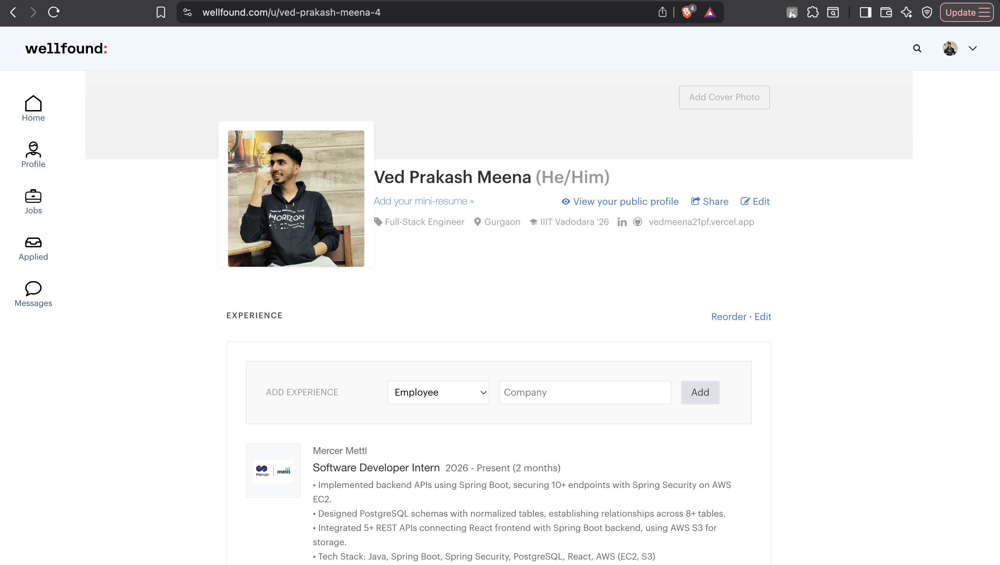
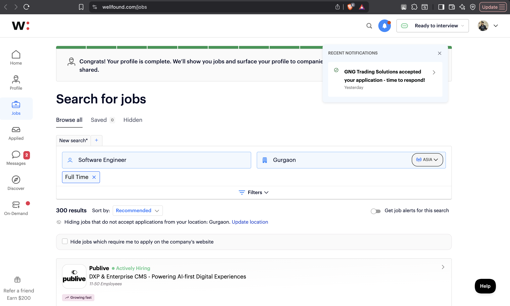
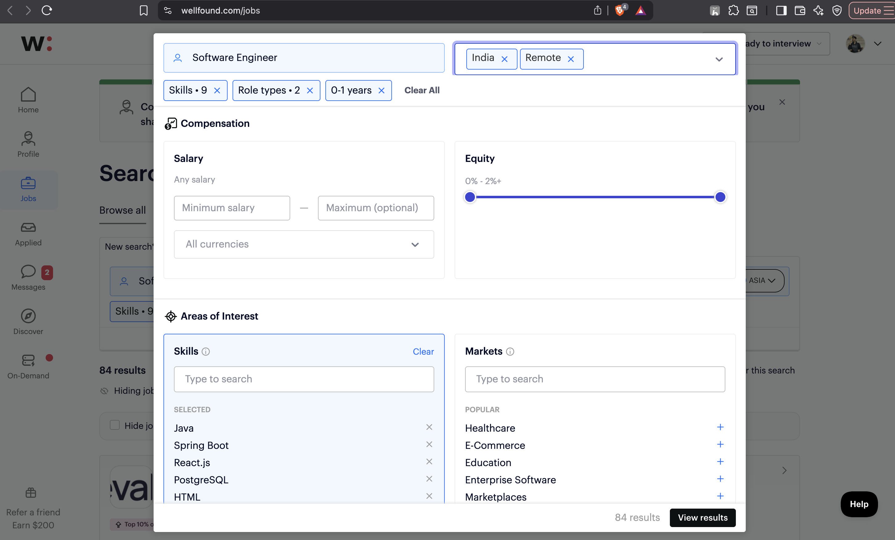
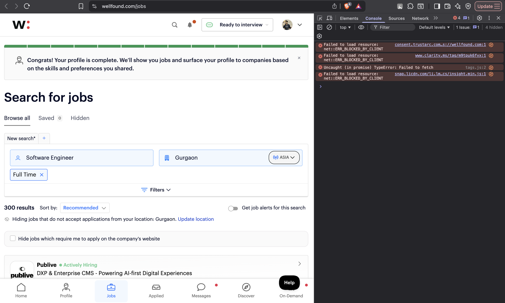
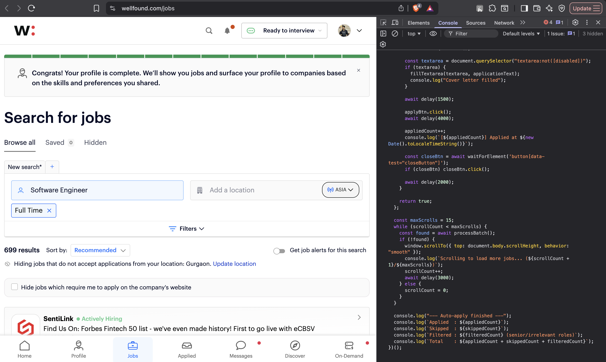

# Wellfound Auto-Apply Script

Automates job applications on [Wellfound (AngelList)](https://wellfound.com/jobs).

Works for **any role, any experience level*```
Wellfound_AutoApply/
├── wellfound_autoapply.js    Main script — update CONFIG and cover letter before use
├── images/                   Screenshots used in this README
└── README.md                 This file
```esher, mid-level, or senior. You control what gets applied to and what gets skipped through a simple config. Setup takes under 5 minutes.

---

## Disclaimer

This script is for personal use only. Update the `CONFIG` and cover letter with your own details before running. Do not use someone else's information. Use responsibly — the script includes built-in delays to reduce the risk of rate-limiting.

---

## Step 1 — Create an Account

Go to [wellfound.com](https://wellfound.com) and sign up. Using **Continue with LinkedIn** auto-fills your profile and saves time.


---

## Step 2 — Complete Your Profile

Go to [wellfound.com/u/edit](https://wellfound.com/u/edit). Fill in your name, headline, experience, education, and links. A complete profile increases visibility to recruiters.


---

## Step 3 — Set Job Preferences

On the same profile edit page scroll to **Preferences**. Set your role, job type, location, and expected salary so Wellfound shows you the right listings.


---

## Step 4 — Check Your Public Profile

Visit your public profile to confirm it looks complete before running the script.



---

## Step 5 — Search for Your Target Jobs and Set Filters

Go to [wellfound.com/jobs](https://wellfound.com/jobs). In the search bar, type the **role you are targeting** — for example `Software Engineer`, `Backend Developer`, `Full Stack Engineer`.

Then use the filter panel on the left to narrow down further by:
- **Experience level** (e.g. Entry Level, Mid Level)
- **Location** (Remote, India, US, etc.)
- **Job type** (Full-time)

**Do this before running the script.** The script applies to everything visible on the page — so the more focused your filters, the better your results.



Example — searching "Software Engineer" and filtering by experience level and location:



---

## Step 6 — Customize the Script

Open `wellfound_autoapply.js` and update the `CONFIG` block at the top:

```javascript
const CONFIG = {
  name: "Your Full Name",
  role: "Your Target Role (e.g. Software Engineer)",
  currentRole: "Your Current Role (e.g. Software Developer Intern at XYZ)",
  github: "https://github.com/YOUR_USERNAME",
  linkedin: "https://www.linkedin.com/in/YOUR_USERNAME",
  portfolio: "https://your-portfolio.com",

  // Titles containing any of these words will be skipped.
  // Customize based on what you want to filter out.
  //
  // Fresher / Junior:
  //   ["senior", "staff", "principal", "lead", "manager", "director", "vp", "head of", "architect"]
  //
  // Mid-level:
  //   ["manager", "director", "vp", "head of"]
  //
  // Apply to everything:
  //   []
  excludedTitles: [
    "senior", "staff", "principal", "lead", "manager",
    "director", "vp", "head of", "architect",
  ],
};
```

Then update the `applicationText` cover letter below it — replace every `[placeholder]` with your own content.

---

## Step 7 — Open the Browser Console

Press **`Cmd + Option + J`** on macOS or **`Ctrl + Shift + J`** on Windows. Click the **Console** tab in the panel that opens.



> If Chrome shows a paste warning, type `allow pasting` in the console and press Enter first.

---

## Step 8 — Paste and Run the Script

Select all the code in `wellfound_autoapply.js`, copy it, click inside the console next to the `>` prompt, paste, and press **Enter**.



Do not switch tabs or scroll manually while the script is running.

---

## Step 9 — Watch It Run

The script opens each job modal, fills the cover letter, and submits. You can watch the progress live in the console.


When all jobs on the page are processed:


---

## How the Exclusion Filter Works

The filter reads the **job title directly from the open modal** — not from the job card. This is more reliable because card elements often show company names instead of role titles.

- If a title contains any word from `excludedTitles`, the modal is closed and the job is skipped.
- If `excludedTitles` is set to `[]`, the script applies to every visible job without filtering anything.

This means you stay in full control of what gets applied to.

---

## Troubleshooting

| Problem | Fix |
|---------|-----|
| Chrome shows paste warning | Type `allow pasting` in the console first |
| Cover letter not filling | Confirm you saved the script — the React-compatible native setter is already built in |
| "Access denied" after a few jobs | Wellfound is rate-limiting. Wait 5-10 minutes and re-run |
| Script ends before processing all jobs | Increase `maxScrolls` from `15` to `25` near the bottom of the script |
| Apply button always disabled | Your Wellfound profile may be incomplete — go back to Steps 2-4 |
| A role I wanted to skip slipped through | Add that keyword to `excludedTitles` in `CONFIG` |

---

## Repository Structure

```
Wellfound_AutoApply/
├── wellfound_autoapply.js    Main script — update CONFIG and cover letter before use
├── images/              Screenshots used in this README
└── README.md                 This file
```

> The resume file is excluded via `.gitignore`. Never commit a personal resume to a public repository.
